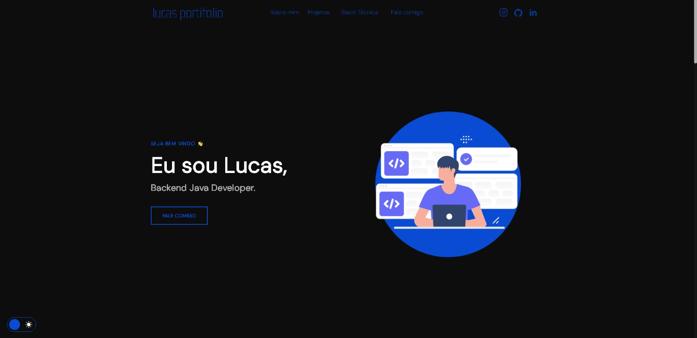

<h1 align="center">Portfólio - Lucas 💻</h1>

<h4 align="center"><a href="https://lucasportifolioweb.netlify.app" target="_blank">Acesse o projeto aqui</a></h4>

---

## 💻 Sobre

Este site foi desenvolvido com o objetivo de me apresentar como desenvolvedor web focado em front-end.

## 🤯 O que você encontra no site:

- **Início:** Uma breve introdução sobre mim;
- **Sobre:** Minha trajetória até aqui e onde estou atualmente;
- **Projetos:** Alguns dos trabalhos mais recentes que desenvolvi;
- **Conhecimentos:** Tecnologias com as quais tenho familiaridade;
- **Contato:** Sessão com canais para entrar em contato comigo;
- **Redes sociais:** Links disponíveis tanto no menu quanto no rodapé.

## 🧠 Tecnologias empregadas

O projeto **ainda está em construção**, pois sigo evoluindo como desenvolvedor. Até o momento, utilizei as seguintes tecnologias:

    
    
    

## 📚 Conceitos aplicados

Durante o desenvolvimento, apliquei diversos fundamentos, como:
+ Estrutura semântica com HTML;
+ Práticas de acessibilidade;
+ Design responsivo;
+ Abordagem mobile first;
+ Integração com a biblioteca JS <a href="https://scrollrevealjs.org" target="_blank">Scroll Reveal</a> para animações.

---

## 🏆 Licença

Distribuído sob a [Licença MIT](./LICENSE).
