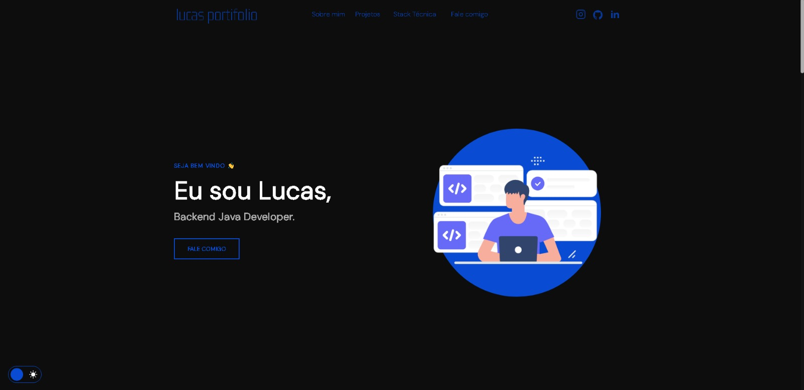

<div align="center">

# 💼 Portfólio Backend Java



**Portfólio profissional de Lucas Morais Souza**  
Backend Java Developer especializado em Spring Boot, PostgreSQL e Docker

[](https://lucasportifolioweb.netlify.app)
[](https://www.linkedin.com/in/lucas-morais-souza-a5b599317/)
[](mailto:lucas.moraisoffice@gmail.com)

</div>

---

## 🎯 Sobre o Projeto

Site desenvolvido para apresentar minha trajetória como **Backend Java Developer**, destacando projetos com **Spring Boot**, **APIs REST**, **PostgreSQL** e **Docker**.

O portfólio demonstra não apenas habilidades técnicas, mas também capacidade de criar soluções escaláveis e seguir boas práticas de desenvolvimento.

---

## 🚀 O que você encontra no site

### 🏠 **Hero Section**
Apresentação direta como **Backend Java Developer** com foco em APIs REST e arquitetura de microsserviços.

### 👨‍💻 **Sobre Mim**
Trajetória desde plugins Minecraft (Java + Bukkit/Spigot) até desenvolvimento de APIs REST enterprise com Spring Boot. Conexão clara entre experiência com POO, eventos e persistência de dados.

### 💼 **Projetos Backend**
Showcase de projetos reais:
- **Helpdesk API** - Sistema de tickets com Spring Boot + PostgreSQL + JWT
- **DayFlow** - Aplicação full-stack com gamificação e ranking global
- **Medical Remember** - App de lembretes com notificações WhatsApp
- **LS Optimizer** - Aplicativo desktop C# para otimização do Windows

### 🛠️ **Stack Técnica**
Organizada por categorias:
- **Backend & APIs:** Java 17, Spring Boot, Hibernate/JPA, Maven, REST APIs
- **Bancos de Dados:** PostgreSQL, MySQL, Redis
- **DevOps:** Docker, Git, Linux, Postman
- **Testes:** JUnit 5, Mockito
- **Conceitos:** Clean Code, SOLID, Design Patterns

### 📧 **Contato**
Links diretos para LinkedIn, email e WhatsApp.

---

## 🧠 Tecnologias do Portfólio

Este site foi construído com tecnologias frontend modernas:

<div align="center">


</div>

### 📚 Conceitos Aplicados
- ✅ Estrutura semântica com HTML5
- ✅ Design responsivo (mobile-first)
- ✅ Animações com Scroll Reveal
- ✅ Acessibilidade (ARIA labels, navegação por teclado)
- ✅ Performance otimizada
- ✅ SEO básico

---

## 🎨 Estrutura do Projeto
```
Portifolio/
├── assets/
│   ├── css/
│   │   └── style.css          # Estilos principais
│   ├── js/
│   │   ├── main.js            # Lógica principal
│   │   ├── projetos.js        # Dados dos projetos
│   │   └── traducao.js        # Sistema de tradução
│   ├── images/                # Imagens e screenshots
│   └── docs/                  # Currículo e documentos
├── index.html                 # Página principal
├── README.md                  # Este arquivo
└── LICENSE                    # Licença MIT
```

---

## 🌐 Deploy

O site está hospedado na **Netlify** com deploy automático a cada push na branch `main`.

[](https://lucasportifolioweb.netlify.app)

**URL de produção:** https://lucasportifolioweb.netlify.app

---

## 🚀 Como Rodar Localmente

1. **Clone o repositório**
```bash
git clone https://github.com/Luqtta/Portifolio.git
cd Portifolio
```

2. **Abra o projeto**
```bash
# Com Live Server (VS Code)
code .
# Ou simplesmente abra index.html no navegador
```

3. **Acesse**
```
http://localhost:5500
```

---

## 📫 Contato

Quer conversar sobre tecnologia, projetos ou oportunidades?

- 💼 **LinkedIn:** [Lucas Morais Souza](https://www.linkedin.com/in/lucas-morais-souza-a5b599317/)
- 🌐 **Portfólio:** [lucasportifolioweb.netlify.app](https://lucasportifolioweb.netlify.app)
- 📧 **Email:** lucas.moraisoffice@gmail.com
- 💬 **WhatsApp:** [+55 62 99518-9743](https://wa.me/5562995189743)

---

## 🏆 Licença

Distribuído sob a [Licença MIT](./LICENSE). Veja `LICENSE` para mais informações.

---

<div align="center">

**Backend Java Developer** • Spring Boot • PostgreSQL • Docker • REST APIs

Made with ☕ by [Lucas Morais Souza](https://github.com/Luqtta)

</div>
